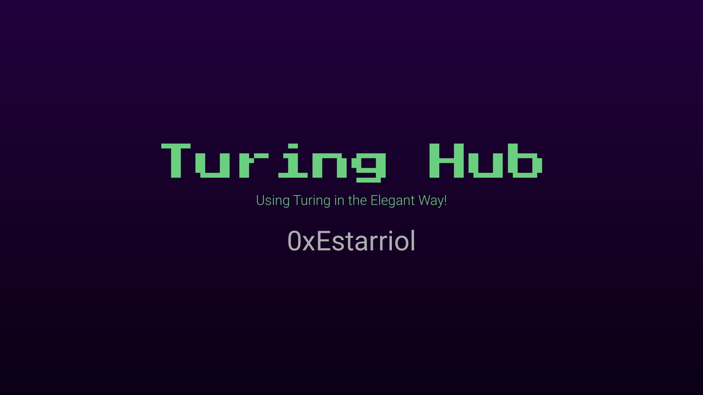

# Turing Hub
Turing Hub provides an all-in-one interface for creating, funding, managing your Truing helper.

With Turing Hub, one can deploy the Turing helper contract with a single click. Comparing to use the Turing helper directly, Turing Hub also provides a more sophisticated interface for managing access control. It allows adding multiple owners to a Turing helper for better team managements, or it can remove the owner completely to avoid changing the configuration accidentally.

Demo: https://turing-hub.medievaldao.games/

>>>>>>> 24c4273 (update readme)
